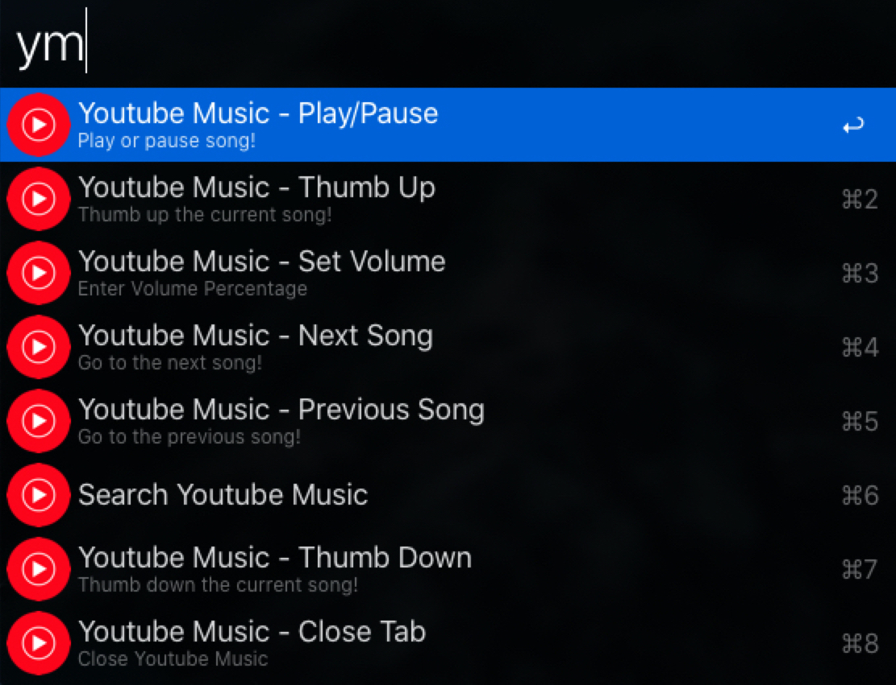
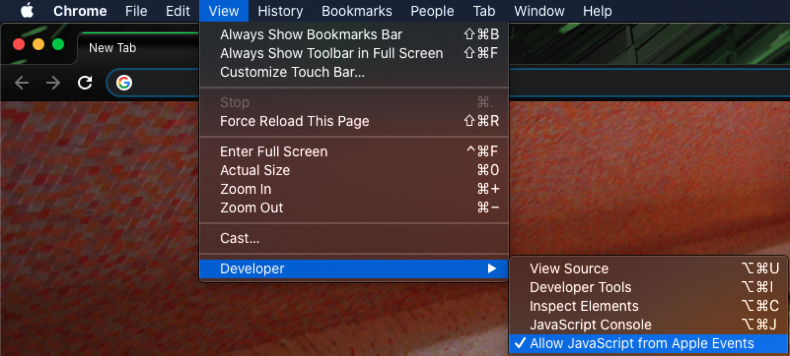

# Alfred Workflow: Youtube Music Controls for Chrome

An Alfred workflow for controlling Youtube Music playback in an open Youtube Music tab in Chrome.

I built this workflow out of necessity as Google Play music will be retired shortly. I listen to music most of the day at work and this helps immensely.

## Hotkey Support

Built-in hotkeys are available for the following actions. After installing the workflow, set the hotkeys to your liking in Alfred.

* Play/Pause
* Previous Song
* Next Song
* Increase Volume
* Decrease Volume

## Keywords

The workflow uses the following keywords to control playback in an open Youtube Music tab:

* `ym`: Play/Pause
* `ym prev`: Previous Song
* `ym next`: Next Song
* `ym+`: Thumbs Up Song
* `ym-`: Thumbs Down Song
* `ym vol <volume percentage>`: Set Youtube Music Volume
* `ym quit`: Close Youtube Music Tab
* `ym search <search term>`: Search Youtube Music

## Requirements

By default, executing JavaScript through AppleScript is turned off in Chrome. To turn it on, from the menu bar, go to *View > Developer > Allow JavaScript from Apple Events*.

For more information: [https://support.google.com/chrome/?p=applescript](https://support.google.com/chrome/?p=applescript)

